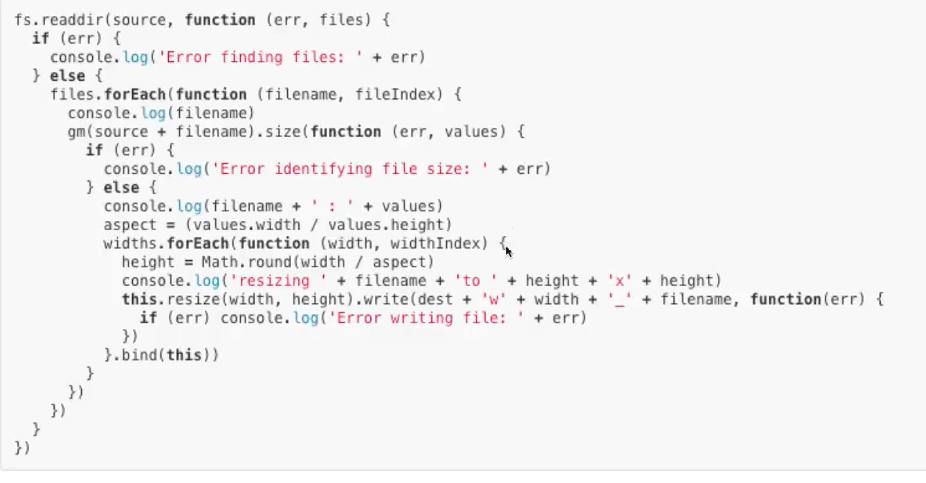

# T3_W1

## JS Event Handling 

Allows you to listen to events. E.g. clicks 

When the click is triggered you can tell JS to execute some sort of code. 

E.g. You have a button and give it an id of 'my-button'

We use attach an event listener with the 

        .addEventListener()

method and pass in what even we want to listen for 'click.

E.g.

        const el = document.querySelector('#my-button')

        el.addEventListener('click', function(event) {
            alert("You clicked the button!")
        }

<strong> Removing Event Listeners </strong>

We can remove an event listener from an object, e.g. when the count has reached 3.

        const el = document.querySelector('button')
        let count = 2 
        el.addEventListener('click', function(e) {
            if (count >= 3) {
                // at 3 clicks the event listener will be removed and no longer used.
                el.removeEventListener('click')
            } else {
                count++ 
                alert('Time clicked: ' + count)
            }
        })

<strong>event.preventDefault()</strong>

Some events have a default action that will occur. E.g. forms have a 'submit' event, which by default will post the form. 

To circumvent the browser's default action 

        const el = document.querySelector('#signup-form')

        el.addEventListener('submit', function(event) {
            event.preventDefault()
        })

<strong>event.target</strong>

VERY USEFUL

The event gives you the html element and its attributes- in turn you can get its value. 

E.g. we console.log() each letter as we type in the input text field. 

        <input id="username" type="text>

        const username = document.querySelector('#username')

        username.addEventListener('input', function(event){
            console.log(event.target.value)
        })

## Callback Functions 

Functions are know as FIRST CLASS OBJECTS  

* Can be stored as a variable or as a property on an object
* Can be returned from a function 
* Can be passed as an argument into another function 

        function processInput(input, callback){
            callback(input);
        }

        function greet(name) {
            console.log('Hello ${name}');
        }

        function excitedGreet(name) {
            console.log("HI THERE" + name.toUpperCase() + "!!);
        }

        processInput("Alex", greet);
        processInput("daniel", excitedGreet);

Output = 

        Hello Alex 
        HI THERE DANIEL!!

## Callbacks in Array Methods

Often referred to as HIGHER ORDER FUNCTIONS 

<strong>Syntax</strong>

        arr.forEach(callback(currentValue[, index [, array]]) {
            // execute something 
        }[, thisArg]);

Code example in short hand:

        const people = ["Alex", "Harry", "Bianca"]

        function logger(element) {
            console.log(element);
        }
        people.forEach(logger);

Output =

        Alex
        Harry
        Bianca

## Callbacks - Error First Pattern

Add error handling to function to stop for example automatic type coercion. 

E.g. 

        doMath(3,"3"), add;)

Will output 

        33

NOT the desired output of...

        6

To get around this issue add an error first pattern to your functions.

        function doMath(num1 , num2, callback) {
            if (typeof num1 !== 'number' || typeof num2 !== 'number'){
                const err = new Error("Can only perform math on numbers")
                callback(err);
                return
            }
            callback(null, num1, num2)
        }

        function multiply(err, a, b) {

            if (err) {
                return console.error(err.message)
            }

            console.log(a * b);
        }

        function add(err, x, y) {
            if (err) {
                return console.error(err.message) 
            }
            console.log(x * y);
        }

        doMath(2,5,multiply);
        doMath(3, 5, add); 

Output = 

        10
        6

The particular thing to note is that you have to pass the error first. Forced to acknowledge that there may be errors. 
 
Another example...

        function useName(name, callback) {
            if (typeof name !='string') {
                const error = new Error("Name must be a string");
                callback(error);
         }  else if (name.length < 1) {
                const error = new Error("Name cannot be empty");
                callback(error)
         }  else {
                callback(null, name)
         }
        }

        function greet(error, name) {
            if (error) {
                console.log(error.message);
                return
            }
            console.log("hello" + name)
        }

        useName(5, greet);

Would output...

        Name must be a string 

And 

        useName("", greet);

Would output...

        Name cannot be empty 

## Asynchronous JS Introduction 

Synchronous code is also referred to as blocking code. 

* Each statement is executed in order and must finish before moving on to the next line of code. 

JS is a single-threaded-language. 

One Thread == One Call Stack == One Thing At A Time 

<strong>Why is this a problem?</strong>

When we are running blocking code nothing else can run. 

* Bad UX to sit and wait 
* Looks like the browser is frozen.

<strong>Synchronous Code(Blocking Code)</strong>

Means we can start something, wait for a response, and let other things happen while we wait. 

E.g. 

        console.log(1)

        setTimeout(() => {
            console.log(2);
        }, 5000);

        console.log(3);

* setTimeout is async
* When the specified time has passed, the callback function is placed on the callback queue.
* When the call stack is empty, the callback function is executed. 

Output =

        1
        3
        2

Callback function is not executed until everything on the call stack is executed. 

## Asynchronous JS - Event Loop Part 1

JS operates asynchronously using the <strong>call stack, callback queue </strong>and <strong>event loop</strong>.

### Call Stack 

* How JS keeps track of the execution order of its code. 
* As the main thread runs. any function calls are pushed as frames onto the stack.
* Once the function has finished executing it pops off the top.
* LIFO (Last In, First Out)

 How a call stack works... 

        let a = 1;

        function x () {
            return "here";
        }

         function y () {
            return x();
        }

         function z () {
            return y();
        }

        z();

Call stack works from top down...

        x()
        y()
        z()

### Call back queue 

* How JS processes responses from async functions 
* When an async function completes its callback function its pushed onto the callback queue 
* Callbacks in the callback queue are not placed on the call stack until it is completely empty 
* FIFO (First In, First Out)

### Event Loop 

The event loop handles asynchronous function call by:

* Placing callback functions on the callback queue when they are ready to be executed 
* Placing callback functions from the queue onto the call stack when it is empty 

## AJAX and Fetch API

* Web API's are one of the most popular tools to access data in web dev
* We send a request to a URL(with AJAX) and the server sends us the required data (usually JSON) back. 

<strong>What is AJAX?</strong>

* Stands for Asynchronous Javascript And XML 
* Allows reloading only specific elements of the page instead of the entire page
* Applied to create fast, dynamic, and modern websites. 
* Not dependent on what browser it's running on.
* Can send and receive info in various formats like JSON, XML, HTML and text files.

### Using AJAX with jQuery 

* JQuery provides us a cleaner syntax and a straightforward implementation.
* Same as most modern AJAX libraries, jQuery's AJAX is built on top of XHR requests. 
* They are just there to abstract away the complexity.

### Fetch API 

* The fetch API is just another way to do the same thing that we can do with XHR.
* It uses Promises instead of callbacks which has made it very popular and can be easier to use. 
* Fetch is the standard for AJAX in modern browsers. 

## Promises Introduction 

A Promise is a placeholder for a future value or event. 

* A JS object 
* Available methods: then, catch, finally 
* A status or state that is immutable 
* A value that depends on the status 

Each method on the Promise takes a a callback function. 

setTimeOut is used to simulate an asynchronous function.

 
E.g 

        function squareNumber(number){
            return new Promise((resolve, reject) => {
                if (typeof number !== 'number') {
                    reject(new Error("Input must be a number"));
                }
                resolve(number * number)
            })
        }

        squareNumber("10")
        .then(squaredNumber => console.log("The square number is" + squaredNumber))
        .catch(error => console.error(error.message))
        .finally(() => console.log("The promise has finished));

        console.log("I'm not blocked");

## Promise Chaining 

<strong>Then Method</strong>

        onResolve

* Takes a callback function 
* Always returns a Promise
* Can be chained forever 

<strong>Catch Method</strong>

        onReject 

* Takes a callback function 
* Will handle any rejected promise in the chain 
* Will also handle any thrown error in the chain 

        function generateRandomNumber (limit) {
            console.log("Generating number between 1-" + limit); 
            return new Promis((resolve, reject) => {
                setTimeout(() => {
                    if (typeof limit !== 'number'){
                        reject(new Error("Input must be a number"));
                    }
                    const randomNumber = Math.floor(Math.random() + limit) + 1
                    resolve(randomNumber)
                }, 1000)
            })
        }

        generateRandomNumber("10")
            .then(number => console.log("The number is" + number))
            .catch(error => console.error("Caught Error: " + error.message))

Output =

        Caught Error: Input must be number 

## Promises - Refactoring Callback Hell 

Hard to define but you know it when you see it.

* Series of nested callbacks
* Nested functions rely on prior function being finished 
* Also known as the Pyramid of Doom 

callbackhell.com

Another example of Callback Hell (pyramid of doom)

Promises are a really useful way of handling this problem.

<strong>Promise.all()</strong> METHOD

* Method takes an iterable of promises as an input and returns a single Promise that resolves to an array of the results of the input promises. 

* Resolves when all of the input's promises have resolved.
 

        function getJoke() {
            return new Promise ((resolve, reject) => {
                $.getJSON("https://icanhazdadjoke.com/", (response) => {
                    if(response) {
                        resolve(response.joke);
                    }
                    reject(new Error("Failed to get Joke));
                })
            }) 
        }

        document.getElementById("button").addEventListener("click", () => {
            let promiseArray = [];
            for(let i = 0; i < 5; i++){
                promiseArray.push(getJoke())
            }
            
                Promise.all(promiseArray)
                .then(jokeArray => console.log(jokeArray))
                .catch(error => console.error("Error caught:" + error.message))
        })

One thing worth noting is that if one of our Promises fail you get back a rejected method. The whole promise rejects. 

